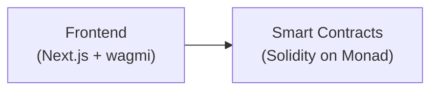
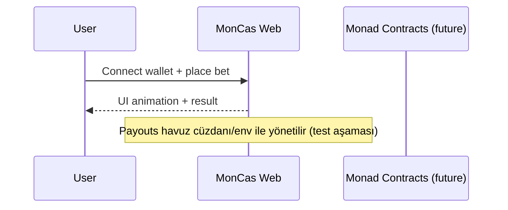

# MDC - Mimari Tasarım Çözümü (MonCas — Monad Casino)

Bu belge MonCas için sadeleştirilmiş mimariyi, bileşenleri ve güvenlik ilkelerini içerir.

## 1) Sistem Bağlamı

- Dış Sistemler: Monad Testnet RPC/Explorer
- İç Bileşenler: `apps/web` (Next.js 14 + wagmi/viem), `contracts` (Foundry/Solidity)

## 2) Bileşenler

- Frontend (`apps/web`)
  - Next.js 14 (App Router), Tailwind, RainbowKit + wagmi/viem
  - Oyunlar: Dice, Crash, Mines, Plinko, Wheel, vb.
  - Güvenlik: Bet limitleri, oturum/işlem takibi, basit bot korumaları
- Smart Contracts (`/contracts`)
  - İleride: Oyun/ödeme muhasebesi ve event yayını (testnet)

## 3) Etkileşim Akışları

## 4) Güvenlik ve İlkeler

- Bahis limitleri: 0.1–5.0 MON
- Oturum/işlem takibi ve hız limiti
- .env ile gizli anahtar yönetimi; build’da sabit anahtar yok
- COOP headerları (same-origin-allow-popups)

## 5) Dağıtım

- local: `npm run dev` ile web (3000)
- testnet: Vercel/Netlify (ücretsiz katman)

## 6) Gözlemlenebilirlik

- `react-hot-toast` ile son‑kullanıcı geri bildirimi
- Hata logları (console) sansürlü ve kısa

## 7) Gelecek Çalışmalar

- Oyunları zincir üstü event’ler ile senkron kılma
- Havuz cüzdanını çoklu‑imza/guard ile sertleştirme
